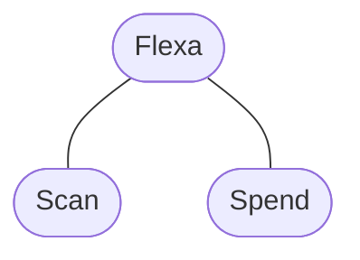

#  Flexa for Android

With Flexa, you can quickly and easily add new modules of functionality to your wallet app.

In the current release, Flexa offers a privacy-focused payments experience for in-person and online spending anywhere Flexa is accepted (Spend), along with a simple scanner module for parsing QR code–formatted payment requests (Scan).

## Modules structure



| Module        | Description                                            |
| ------------- | ------------------------------------------------------ |
| Flexa   | Core functionality required by all other modules       |
| Scan  | Camera-based parsing of QR codes for payments and more |
| Spend | Instant retail payments, powered by Flexa              |

## Installation

Flexa can be integrated **locally** or using **package repository**

### Local repository

1. Run the next buildScript from the SDK root folder:

```groovy
./gradlew core:assembleDebug && ./gradlew core:publishToMavenLocal && ./gradlew scan:assembleDebug && ./gradlew scan:publishToMavenLocal && ./gradlew spend:assembleDebug && ./gradlew spend:publishToMavenLocal

```

2. Add `mavenLocal()` repository to `settings.gradle`:

```groovy
dependencyResolutionManagement {
    repositoriesMode.set(RepositoriesMode.FAIL_ON_PROJECT_REPOS)
    repositories {
        ...
        mavenLocal() <---
    }
}
```

3.  Add module dependency in your project [module-level build.gradle](https://developer.android.com/studio/build#module-level) file:

**Identity** module:

```groovy
implementation "com.flexa:core:1.0.8"
```

**Scan** module:

```groovy
implementation "com.flexa:scan:1.0.8"
```

**Spend** module:

```groovy
implementation "com.flexa:spend:1.0.8"
```

### Remote repository

#### GitHub Package Registry

1. Set flexa username and access token to a project [local.properties](https://developer.android.com/build#properties-files) file:
   :warning: *Note: this file must *NOT* be checked into Version Control Systems*:warning:

    ```properties
    gpr.user=flexa
    gpr.key=access_token
    ```

2. Add GitHub Package Registry repository to the [settings.gradle](https://developer.android.com/build#settings-file) file:

    ```groovy
    dependencyResolutionManagement {
        ...
        repositories {
            ...
            maven {
                name = "GitHubPackages"
                url = uri("https://maven.pkg.github.com/flexa/flexa-android")
                credentials {
                    def propertiesFile = file("local.properties")
                    def localProperties = new Properties()
                    localProperties.load(new FileInputStream(propertiesFile))
                    username = localProperties['gpr.user'] ?: ""
                    password = localProperties['gpr.key'] ?: ""
                }
            }
        }
    }
    ```
    
3. Add module dependency in your project [module-level build.gradle](https://developer.android.com/studio/build#module-level) file:

    **Identity** module:

    ```groovy
    implementation "com.flexa:core:1.0.8"
    ```

    **Scan** module:

    ```groovy
    implementation "com.flexa:scan:1.0.8"
    ```

    **Spend** module:

    ```groovy
    implementation "com.flexa:spend:1.0.8"
    ```


## Usage

1. The SDK initialization:

    ```kt
    val accountId = "Account ID"
    val accountIdSha256 = MessageDigest.getInstance("SHA-256")
        .digest(accountId.toByteArray())
        .fold("") { str, it -> str + "%02x".format(it) }
    Flexa.init(
        FlexaClientConfiguration(
            context = applicationContext,
            publishableKey = "key",
            theme = FlexaTheme(
                useDynamicColorScheme = true,
            ),
            assetAccounts = arrayListOf(
                AssetAccount(
                    assetAccountHash = accountIdSha256,
                    displayName = "My Wallet",
                    icon = "https://flexa.network/static/4bbb1733b3ef41240ca0f0675502c4f7/d8419/flexa-logo%403x.png",
                    availableAssets = emptyList()
                )
            ),
            webViewThemeConfig = "{\n" +
                    "    \"android\": {\n" +
                    "        \"light\": {\n" +
                    "            \"backgroundColor\": \"#100e29\",\n" +
                    "            \"sortTextColor\": \"#ed7f60\",\n" +
                    "            \"titleColor\": \"#ffffff\",\n" +
                    "            \"cardColor\": \"#2a254e\",\n" +
                    "            \"borderRadius\": \"15px\",\n" +
                    "            \"textColor\": \"#ffffff\"\n" +
                    "        },\n" +
                    "        \"dark\": {\n" +
                    "            \"backgroundColor\": \"#100e29\",\n" +
                    "            \"sortTextColor\": \"#ed7f60\",\n" +
                    "            \"titleColor\": \"#ffffff\",\n" +
                    "            \"cardColor\": \"#2a254e\",\n" +
                    "            \"borderRadius\": \"15px\",\n" +
                    "            \"textColor\": \"#ffffff\"\n" +
                    "        }\n" +
                    "    }\n" +
                    "}"
            )
        )

    ```

2. Start Spend or Identity module:

    ```kt
    // Spend
    Flexa.buildSpend()
        .onTransactionRequest { transaction -> }
        .build().open(activity)
    
    // Identity
    Flexa.buildIdentity()
        .onResult { result ->
            connectResult = when (result) {
                is ConnectResult.Connected -> {}
                else -> {}
                }
        }
        .build()
        .open(activity)

    ```

### Payment Flow

1. Open the spend module

    ```kt
    Flexa.buildSpend()
        .onTransactionRequest { transaction -> 
        
        }
        .open(activity)
    ```

2. Choose your asset and scan the flexcode
3. Get the transaction details in `onTransactionRequest` listener:

    ```kt
    ...
        .onTransactionRequest { transaction ->
            // Complete your transaction
        }
    ...
    ```

### Merchant Payment Flow

1. Open the spend module:

    ```kt
    Flexa.buildSpend()
        .onTransactionRequest { transaction ->
        
         }
        .open(activity)
    ```

2. Choose a merchant
3. Input a payment amount
4. Get the transaction data:

   ```kt
    ...
        .onTransactionRequest { transaction ->
            // Complete your transaction
        }
    ...
   ```

5. Execute the transaction
6. Send the transaction signature:

   ```kt
   Flexa.buildSpend()
        .transactionSent(
            "commerceSessionId",
            "txSignature"
        )
   ```

7. Scan the flexcode from the spend module main screen dialog

### Transaction bundle

```kt
data class Transaction(
    val commerceSessionId: String,
    val amount: String,
    val brandLogo: String,
    val brandName: String,
    val brandColor: String,
    val assetAccountHash: String,
    val assetId: String,
    val destinationAddress: String,
    val feeAmount: String,
    val feeAssetId: String,
    val feePrice: String,
    val feePriorityPrice: String,
    val size: String,
)
```

### App Links [handling](https://developer.android.com/training/app-links)

1. Add intent filter to your intent-receiving activity

    ```xml
    <intent-filter android:autoVerify="true">
        <action android:name="android.intent.action.VIEW" />
            <category android:name="android.intent.category.DEFAULT" />
            <category android:name="android.intent.category.BROWSABLE" />
            <data
                android:host="provided_host"
                android:scheme="https" />
    </intent-filter>
    ```

1. Open Identity or Spend module by app link

    ```kt
        val appLink = "app link raw data"
        // Identity
        Flexa.buildIdentity()
            .onResult { result ->
                connectResult = when (result) {
                    is ConnectResult.Connected -> {}
                    else -> {}
                    }
            }
            .build()
            .open(activity, appLink)

        // Spend
        Flexa.buildSpend()
            .onTransactionRequest { transaction -> }
            .build().open(activity, appLink)
    ```

### Requirements

Minimum SDK version 26

### Authentication

Flexa requires your app to embed a valid publishable key, which will enable it to communicate with Flexa in order to request details of currently supported assets, the equivalent US dollar (or other local currency) balances for your user’s assets, and payment session details whenever a payment is initiated.

To obtain your publishable key, please contact a member of the Flexa team.

## Privacy

Flexa will **never** attempt to access your users’ private keys, wallet addresses, a history of any actions taken in-app, or other sensitive wallet details. There is no method that enables you to provide any of this information to modules, and modules does not automatically extract any of this information from your app.

In order to enable payments for your users, federal regulations require Flexa to collect some personal information. This information typically consists of a user’s full name and date of birth. For higher-value payments, it can also include a photo ID document and photograph. This information is used only for verification purposes, and Flexa will never share this information with you or with any of the business your users pay.

Please note that making any modifications to your app or any of Flexa’s code with the intent to gather, retain, or otherwise access this personal information is expressly prohibited by the Flexa Developer Agreement, and will result in a permanent ban from using Flexa software for your business and any related individuals.

## Contributing

We welcome and appreciate contributions to Flexa from the open source community.

- For larger changes, please open an issue describing your objectives so that we can coordinate efforts.
- Or, if you would like to make a minor edit (such as a single-line modification or to fix a typo), please feel free to open a pull request with your changes and we will review it promptly.

## License

Flexa for Android is [available under the MIT License](LICENSE.md).
